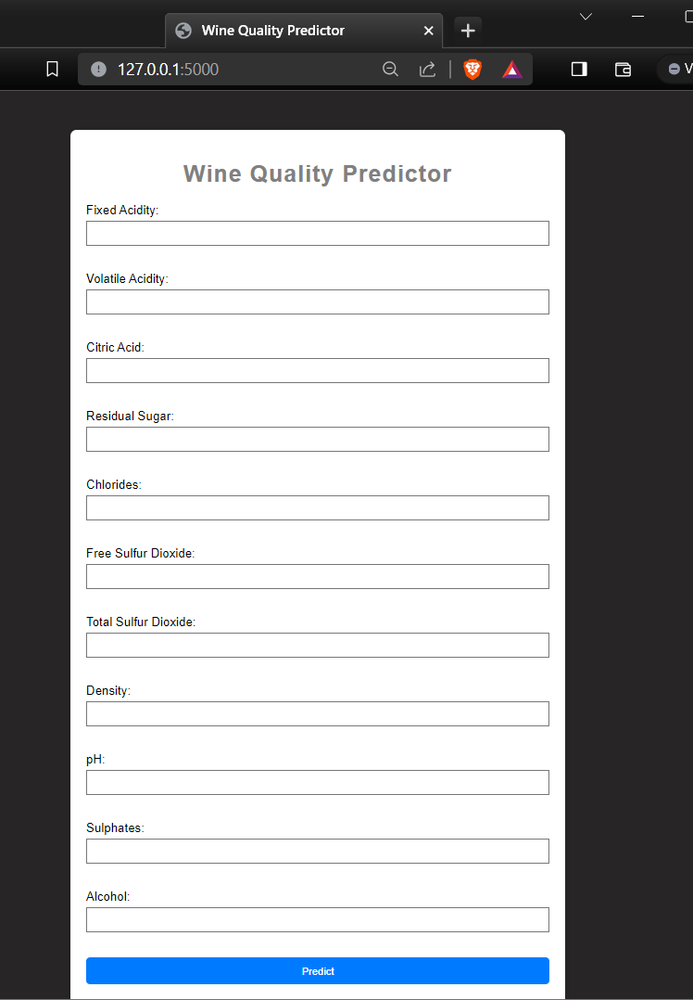

# Wine Quality Prediction

## Overview

This project focuses on predicting the quality of wines based on various features. The dataset used for this prediction contains information about different wines, including their chemical properties.

## Table of Contents

- [Wine Quality Prediction](#wine-quality-prediction)
  - [Overview](#overview)
  - [Table of Contents](#table-of-contents)
  - [Data](#data)
  - [Models](#models)
  - [Installation](#installation)
  - [UI](#ui)
  - [Usage](#usage)
  - [Contributing](#contributing)

## Data

It includes information about various wines, such as fixed acidity, volatile acidity, citric acid, residual sugar, chlorides, free sulfur dioxide, total sulfur dioxide, density, pH, sulphates, and alcohol. The target variable is the quality of the wine.

## Models

We have employed several machine learning models for predicting wine quality. The primary models include Random Forest, Logistic Regression,Support Vector Machines (SVM) , and K-Nearest Neighbor. The accuracy scores for each model are as follows:

- Random Forest: 93.12
- Logistic Regression: 89.69
- SVM: 88.44
- K-Nearest Neighbor: 87.1

## Installation

To run this project locally, follow these steps:\*\*\*\*

1. Clone the repository:

   ```bash
   git clone https://github.com/mideyolu/Machine-Learning/tree/main/Wine-quality.git
   ```

2. Navigate to the project directory:

   ```bash
   cd Wine-quality
   ```

3. Install the required dependencies:
   ```bash
   pip install -r requirements.txt
   ```

## UI



1. Navigate to the project directory:
   ```bash
   cd Wine-quality then cd UI
   ```
2. run the following command in the terminal: python app.py

## Usage

1. Ensure you have installed the required dependencies.
2. Run the prediction script:
   ```bash
   python winequality.ipynb
   ```

## Contributing

If you'd like to contribute to this project, feel free to fork the repository and submit a pull request. Contributions are always welcome!
